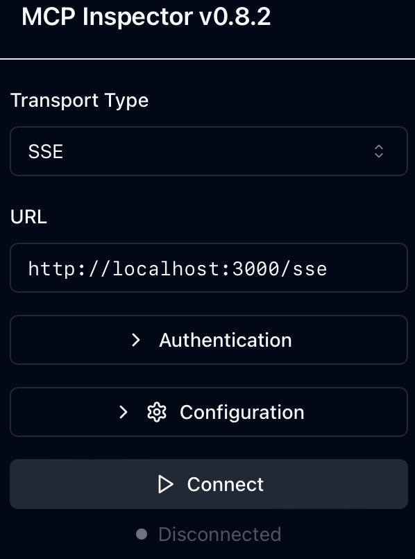
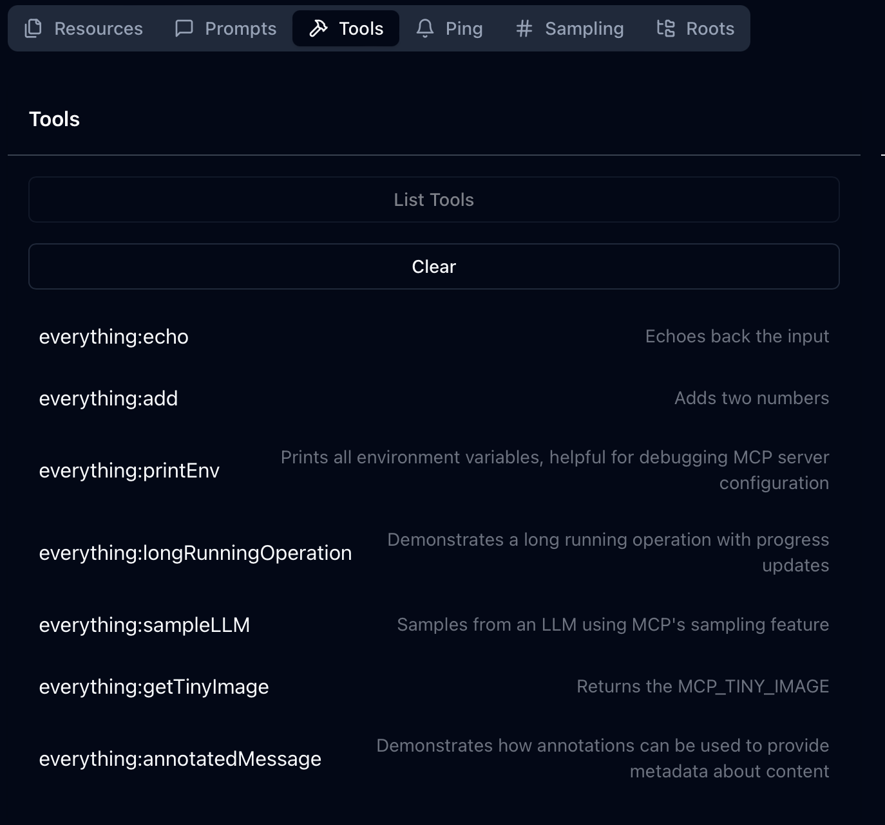
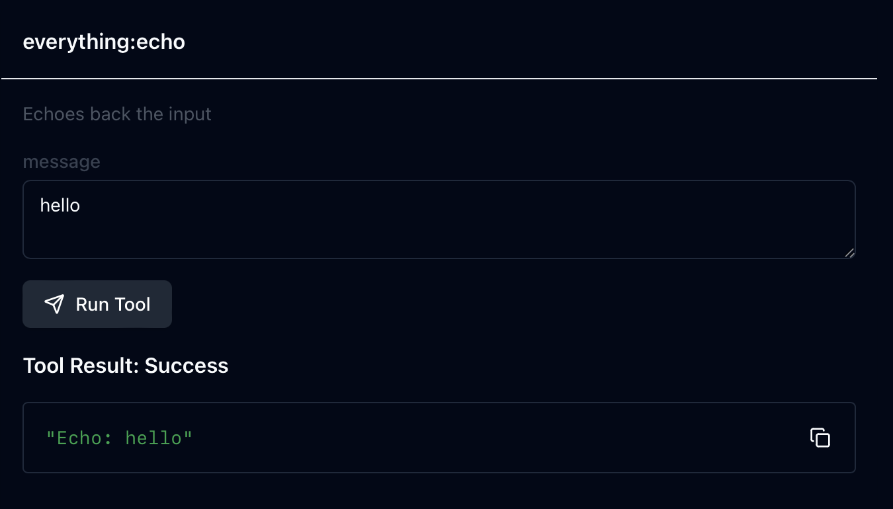

## Basic Example

This example shows how to use the mcp-proxy to proxy requests to the `everything` tool.

### Running the example

```bash
cargo run -- -f examples/basic/config.json
```

Let's look at the config to understand what's going on. First off we have a listener, which tells the proxy how to listen for incoming requests/connections. In this case we're using the `sse` listener, which is a simple HTTP listener that listens on port 3000.

```json
  "listener": {
    "sse": {
      "host": "0.0.0.0",
      "port": 3000
    }
  }
```

Next we have a targets section, which tells the proxy how to proxy the incoming requests. In this case we're using the `everything` tool, which is a tool that can do everything.

```json
  "targets": [
    {
      "name": "everything",
      "stdio": {
        "cmd": "npx",
        "args": [
          "@modelcontextprotocol/server-everything"
        ]
      }
    } 
  ]
```

Now that we have the proxy running, we can use the [mcpinspector](https://github.com/modelcontextprotocol/inspector) to try it out.
```bash
npx @modelcontextprotocol/inspector
```
Once the inspector is running, it will present the port that it's running on, and then you can navigate to it in your browser.



Once you're connected, you can navigate to the tools tab and see the available tools.



Let's try out one of the tools, like `everything:echo`.



That worked! The proxy was able to proxy the request to the `everything` tool and return the response.