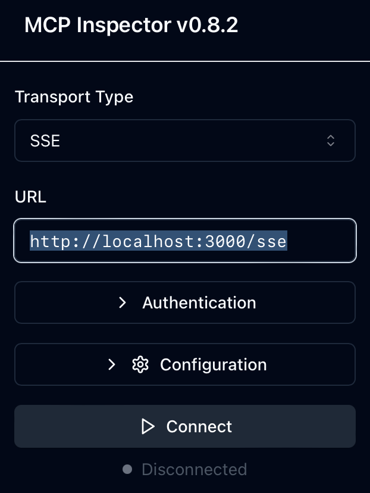
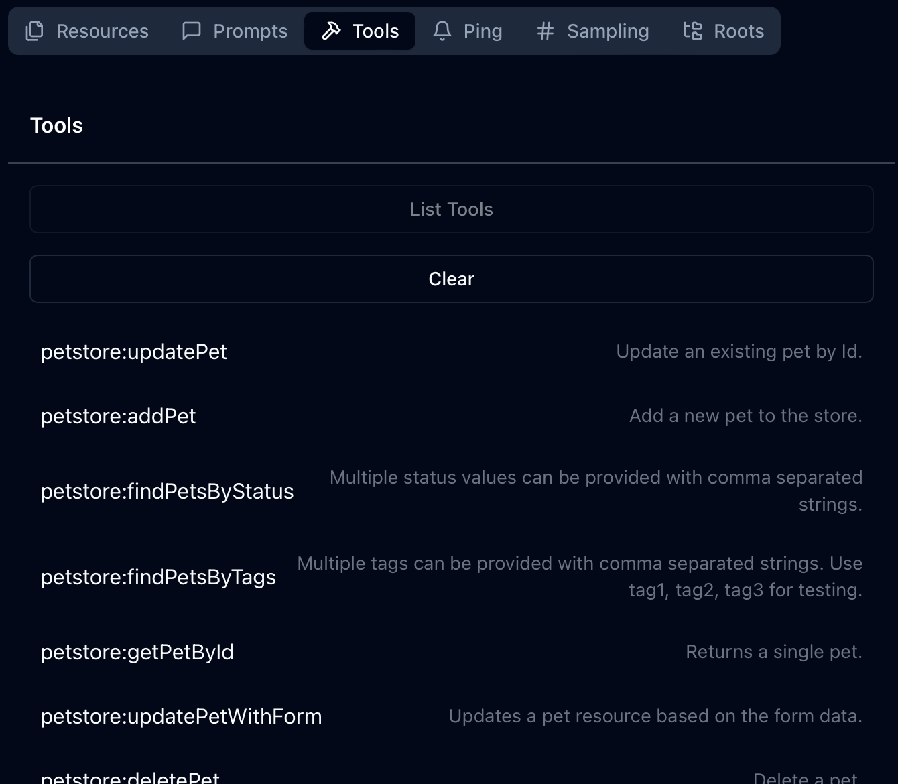
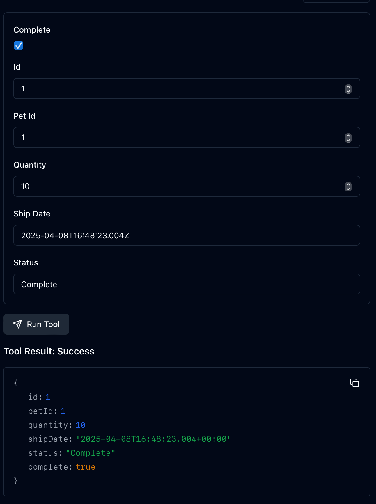

## OpenAPI Example

This example shows how to use the mcp-proxy to proxy a OpenAPI as a MCP service.

OpenAPI is the current backbone of the internet, and it's a great way to describe your API. However, it's not geared towards agentic use-cases. Using mcp-proxy, you can seamlessly integrate OpenAPI APIs into your agentic workflows in a secure and scalable way.

This example will show you how to proxy the [Swagger Petstore](https://petstore3.swagger.io) as the example MCP service.

### Running the example

```bash
cargo run -- -f examples/openapi/config.json
```

Let's look at the config to understand what's going on. First off we have a listener, which tells the proxy how to listen for incoming requests/connections. In this case we're using the `sse` listener, which is a simple HTTP listener that listens on port 3000.
```json
  "listener": {
    "sse": {  
      "host": "0.0.0.0",
      "port": 3000
    }
  }
```

Next we have a targets section, which tells the proxy how to proxy the incoming requests to the target. In this case we're proxying to the [Swagger Petstore](https://petstore3.swagger.io). In the future we will also support remote OpenAPI specs via URL.
```json
  "targets": [
    {
      "name": "petstore",
      "openapi": {
        "host": "petstore3.swagger.io",
        "port": 443,
        "schema": {
          "file_path": "examples/openapi/openapi.json"
        }
      }
    }
  ]
```

Now that we have the proxy running, we can use the [mcpinspector](https://github.com/modelcontextprotocol/inspector) to try it out.
```bash
npx @modelcontextprotocol/inspector
```

Once the inspector is running, it will present the port that it's running on, and then you can navigate to it in your browser.



Once you're connected, you can navigate to the tools tab and see the available tools.



Let's try out one of the tools, like `placeOrder`.



