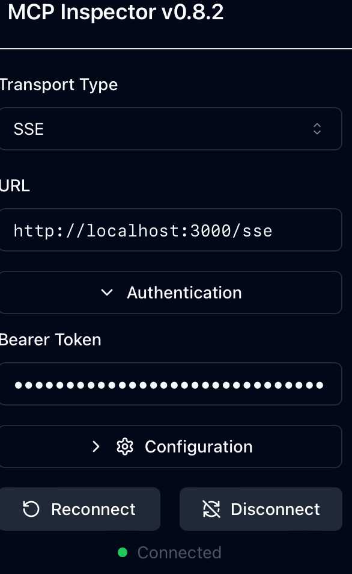
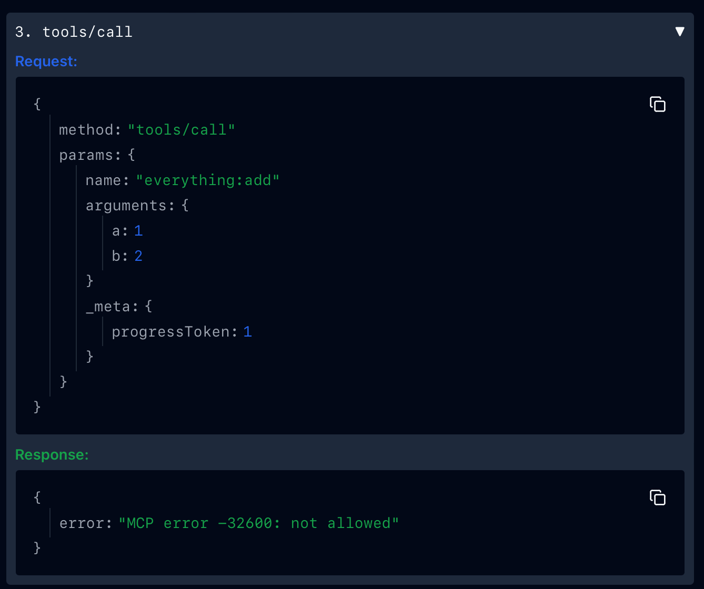

## RBAC Example

This example shows how to use the mcp-proxy to perform MCP native RBAC.

### Running the example

```bash
cargo run -- -f examples/rbac/config.json
```

Let's look at the config to understand what's going on. First off we have a listener, which tells the proxy how to listen for incoming requests/connections. In this case we're using the `sse` listener, which is a simple HTTP listener that listens on port 3000. In addition we have a JWT authentication section, which tells the proxy how to authenticate the incoming requests. In this case we're using a local JWT public key file to authenticate the incoming requests.
```json
  "listener": {
    "sse": {
      "host": "0.0.0.0",
      "port": 3000,
      "authn": {
        "jwt": {
          "issuer": ["me"],
          "audience": ["me.com"],
          "jwks": {
            "local": {
              "file": "manifests/jwt/pub-key"
            }
          }
        }
      }
    }
  }
```

Next we have a policies section, which tells the proxy how to authorize the incoming requests. In this case we're using a static policy, which is a list of policies that are applied to the incoming requests.
```json
  "policies": [
    {
      "key": "sub",
      "value": "me",
      "resource": {
        "tool": {
          "id": "everything:echo"
        }
      },
      "matcher": {
        "equals": {}
      }
    }
  ]
```

Finally we have a targets section, which tells the proxy how to proxy the incoming requests to the target. In this case we're proxying to the [Everything](https://github.com/modelcontextprotocol/servers/blob/main/src/everything) server.
```json
  "targets": [
    {
      "name": "everything",
      "stdio": {
        "cmd": "npx",
        "args": [
          "@modelcontextprotocol/server-everything"
        ]
      }
    }
  ]
```

Now that we have the proxy running, we can use the [mcpinspector](https://github.com/modelcontextprotocol/inspector) to try it out.
```bash
npx @modelcontextprotocol/inspector
```

Now that we have the inspector running, let's connect to the proxy, for this tutorial we'll need to use a JWT token. If we try without we will get an error.
```
NiIsImtpZCI6IlhoTzA2eDhKaldIMXd3a1dreWVFVXhzb29HRVdvRWRpZEVwd3lkX2htdUkiLCJ0eXAiOiJKV1QifQ.eyJhdWQiOiJtZS5jb20iLCJleHAiOjE5MDA2NTAyOTQsImlhdCI6MTc0Mjg2OTUxNywiaXNzIjoibWUiLCJqdGkiOiI3MDViYjM4MTNjN2Q3NDhlYjAyNzc5MjViZGExMjJhZmY5ZDBmYzE1MDNiOGY3YzFmY2I1NDc3MmRiZThkM2ZhIiwibmJmIjoxNzQyODY5NTE3LCJzdWIiOiJtZSJ9.cLeIaiWWMNuNlY92RiCV3k7mScNEvcVCY0WbfNWIvRFMOn_I3v-oqFhRDKapooJZLWeiNldOb8-PL4DIrBqmIQ
```



Now that we're connected, let's try out the echo tool.


That worked because we have access to it via the policy. Let's try out the addPet tool.



That didn't work because we don't have access to it via the policy.


